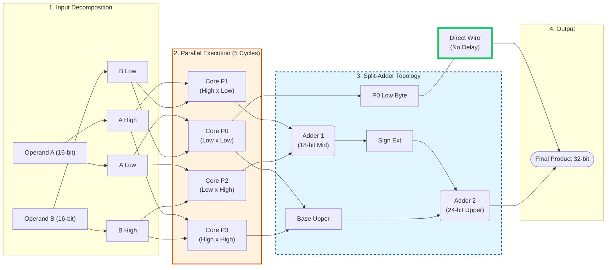

# High-Performance 16-bit Mixed-Mode Booth Radix-8 Multiplier

<div align="center">
  <h2> (Optimized for Lattice iCE40 - Supports Signed & Unsigned Operations) </h2>
  <h3>🚀 Now v2.0: Faster (145 MHz), Lower Latency (5 Cycles), and Smaller Area!</h3>
</div>


A highly optimized, soft-core 16-bit multiplier designed specifically for Lattice iCE40 FPGAs. Through deep architectural optimizations  (**Flattened Control Mux** and **Split-Adder Topology** ), this V2 core achieves **~145 MHz** performance and a deterministic latency of just **34.5ns**  (5 cycles), outperforming standard serial implementations by over 5x while consuming only ~5% of the FPGA resources.

## 📊 High-Level Diagram



---

### Performance Comparison (iCE40)

This project provides three variations of the Booth Radix-8 multiplier, optimized for different constraints (Area, Latency, or Throughput). The synthesis results below target the **Lattice iCE40** architecture.

| Source File | Architecture | Latency (Cycles) | Max Frequency | Resources (LCs) | Throughput (MOPS)* | Best Use Case |
| :--- | :--- | :---: | :---: | :---: | :---: | :--- |
| `..._su_5_linear_146.v` | Iterative (Linear) | 5 | **149.10 MHz** | **441 (5%)** | 29.8 | **Low Area**: Best for generic use where space is tight. |
| `..._su_7_linear_155.v` | Linear + IO Regs | 7 | 149.10 MHz | 441 (5%) | 21.3 | **Robustness**: Registered I/O ensures easier timing closure in full designs. |
| `..._su_4_pipeline_144.v` | Decoupled Pipeline | **4 (Sustained)** | 141.00 MHz | 463 (6%) | **35.2** | **High Throughput**: Best for DSP/Streaming (Audio, Video, Filters). |

*\* **MOPS**: Million Operations Per Second (Calculated as $F_{max} / \text{Cycles per Op}$).*

#### Detailed Analysis

1.  **`_su_5_linear_146.v` (Standard)**
    *   **Pros:** Lowest absolute latency (time from input to output). Smallest footprint.
    *   **Cons:** Lack of input buffering may cause routing congestion or lower system frequency when integrated into larger designs.

2.  **`_su_7_linear_155.v` (Registered I/O)**
    *   **Pros:** Isolates the math core from the I/O pins. This makes the module very stable and predictable regardless of where it is placed on the FPGA.
    *   **Cons:** Higher latency (7 cycles) results in lower overall throughput.

3.  **`_su_4_pipeline_144.v` (Pipeline)**
    *   **Pros:** **Highest Throughput.** Uses a decoupled input buffer and a sequencer. It can accept new data every 4 cycles while the previous calculation finishes in the background.
    *   **Cons:** Slightly higher resource usage (+22 LCs) and a marginal drop in max frequency due to control logic complexity.

#### Recommendation
*   For **Stream Processing (DSP)**: Use the **Pipeline** version (`_su_4`).
*   For **General Purpose/CPU**: Use the **Linear** version (`_su_5`).

## 📈 Waveform Verification

)


## 🚀 Key Features

*   **Industrial Performance:** Achieves **144.9 MHz** on iCE40HX8K (Speed Grade 1).
*   **Ultra-Low Latency:** Completes a 16x16 operation in just **5 clock cycles** (Total time: ~34.5ns).
*   **PPA Optimized:** Faster *and* smaller than previous versions (~407 LCs).
*   **Zero DSP Usage:** Implemented entirely in soft logic (LUTs/Carry Chains).
*   **Parallel Architecture:** Uses 8-bit Decomposition (4 parallel cores) + Split-Adder Recombination.
*   **Advanced Optimization:** Implements **"Look-Ahead 3M"** + **"Flattened Control Logic"** to minimize logic levels.
*   **Full Mode Support:** Supports Signed, Unsigned, and Mixed-mode (Signed × Unsigned) operations.

## 📊 Performance Benchmarks

Synthesized using Yosys/Nextpnr for **iCE40HX8K-CT256**. Comparison against a standard "Shift-and-Add" Serial Multiplier:

| Metric | Standard Serial Mult | **Booth Radix-8 (V2)** | Improvement |
| :--- | :--- | :--- | :--- |
| **Fmax (Frequency)** | 96.8 MHz | **145.45 MHz** | **+50% Faster Clock** |
| **Latency (Cycles)** | 17 Cycles | **5 Cycles** | **3.4x Fewer Cycles** |
| **Total Execution Time** | ~175.4 ns | **~34.4 ns** | **5.1x Faster Calculation** |
| **Area (Logic Cells)** | ~340 LCs | **~407 LCs** | Extremely Efficient (~5% util) |

> **Note:** Version 2.0 reduced the area by ~17% compared to V1 while increasing speed by ~9%.

## 🛠️ Usage

### Instantiation Template

```verilog
booth_radix8_multiplier #(
    .WIDTH(16)
) u_multiplier (
    .clk(clk),
    .rst_n(rst_n),
    .start(start_signal),       // One-cycle pulse to start
    .multiplicand(op_a),        // 16-bit input A
    .multiplier(op_b),          // 16-bit input B
    .sign_mode(2'b11),          // Mode control (see below)
    .product(result),           // 32-bit output
    .done(done_signal),         // High when result is ready
    .busy(busy_signal)          // High while calculating
);
```
### Sign Modes (sign_mode)

This core handles bit extension automatically based on the selected mode:
    
    2'b00: Unsigned × Unsigned
    2'b01: Unsigned × Signed (A is Unsigned, B is Signed)
    2'b10: Signed × Unsigned (A is Signed, B is Unsigned)
    2'b11: Signed × Signed (Standard behavior)

## ⚡ How to Simulate

Prerequisites: Icarus Verilog and GTKWave.
```bash
git clone https://github.com/guinamen/ice40-booth-multiplier.git
cd ice40-booth-multiplier
iverilog -Wall -o sim_mult.out tb/tb_booth_radix8_su_simple.v  rtl/booth_radix8_multiplier.v
vvp sim_mult.out
gtkwave dump.vcd
```

## ⚡ How to Synthesize 

Prerequisites: Yosys and Icetime.
```bash
script/synthesis.sh rtl/booth_radix8_multiplier.v
```

## ⚙️ Architectural Details

The high speed of this core comes from three specific optimizations targeting the iCE40 LUT4 architecture:

1. "Flattened" Control Logic

Standard Booth multipliers use a deep logic chain (Decode → Select → Invert → Add). This design calculates selection signals (1x, 2x, 3x, 4x) and inversion flags in parallel, reducing the logic depth before the adder to just 1 LUT level.

2. Look-Ahead 3M Calculation

The hard "3×M" term (M + 2M) is pre-calculated during the setup cycle and stored in a register. This removes the adder overhead from the critical path of the iterative loop.

3. Split-Adder Topology (Top Level)

Instead of recombining the 4 sub-products using a slow 32-bit chain, the final adder is split. We skip carry propagation for the lower 8 bits (which require no addition), effectively turning the final stage into a faster ~24-bit adder.

## 📄 License

This project is open-source and available under the MIT License.
